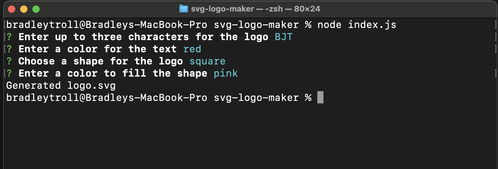
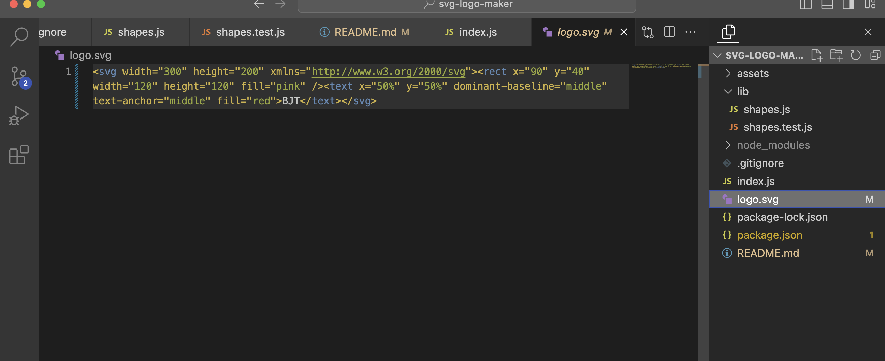
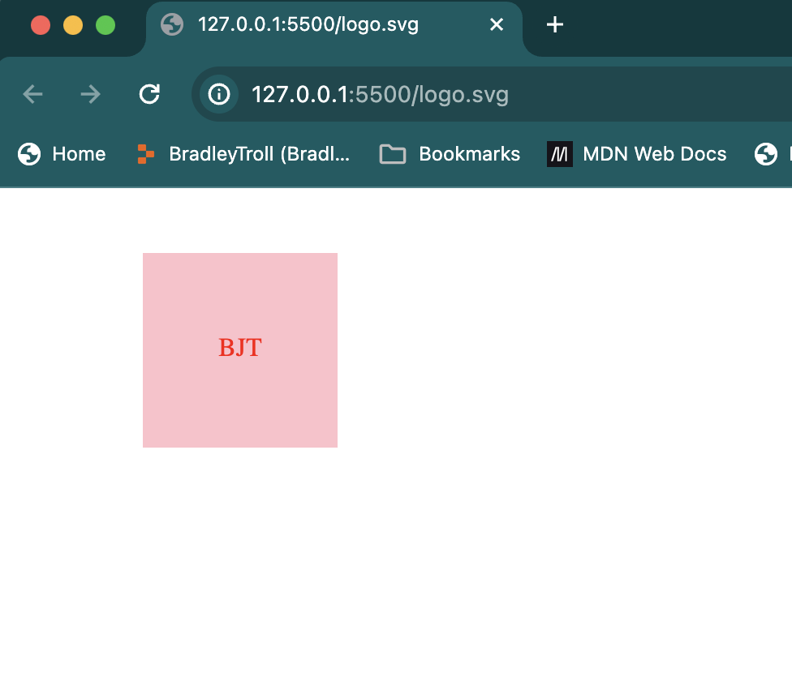

# SVG Logo Maker

## Description

SVG Logo Maker is a Node.js application that allows users to create custom logos (as svg files) based on user input. Inquirer is used for command-line interactions, allowing users to selct a 3-character logo, font color, shape for the logo, and fill color for the shape. 

## Table of Contents

- [Installation](#installation)
- [Usage](#usage)
- [Credits](#credits)
- [License](#license)
- [How to Contribute](#how-to-contribute)
- [Tests](#tests)

## Installation

Make sure Node.js is installed on your computer. Then, follow these steps:
1. Clone the repo to your machine: 
```md
git clone http://github.com/bradleytroll/svg-logo-maker.git
```
2. Navigate to the cloned directory.
3. Install the necessary dependencies:
```md
npm install
```

## Usage

1. Type the following command into your terminal:
```md
node index.js
```
2. Follow the on-screen prompts and answer each question. 
3. Look in your directory for a newly-created logo.svg file. 
4. View the file with a live server to see the logo.







## Credits

This application makes use of the following dependencies:
- [Jest](https://jestjs.io/)
- [Inquirer](https://www.npmjs.com/package/inquirer)

## License 

This project is licensed under the MIT License. 

## How to Contribute

Please request a pull through GitHub if you would like to contribute to this pcoress. 

## Tests

The application includes a test suite to verify that shapes are being rendered correctly. To run the tests,navigate to the correct file location and type:
```md
npm test
```

## Video Walkthrough

Click the link below to see a video demonstation of this application.
[Video Walkthrough](https://...)